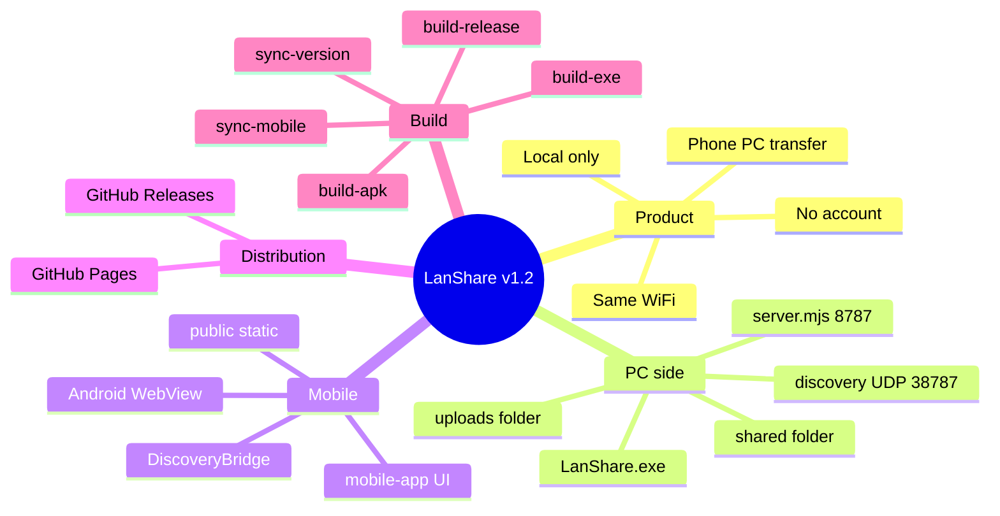
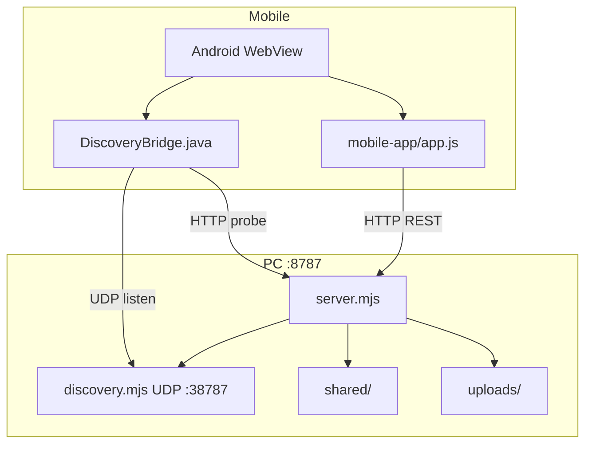
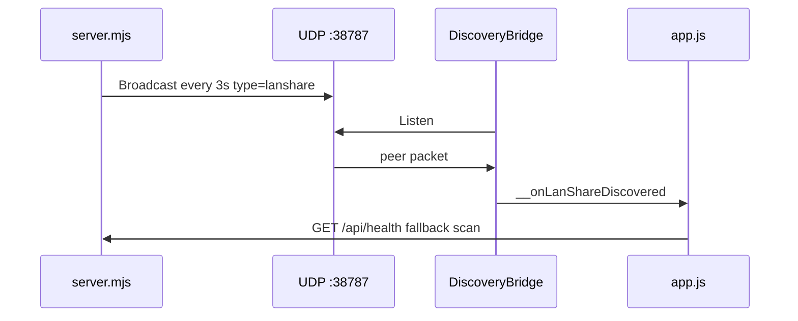

<h1 align="center">LanShare</h1>

<p align="center">
  Transfer files between phone and PC over local WiFi · No cloud · No account · MIT open source
</p>

<p align="center">
  <a href="https://aiyangdie.github.io/lan-share/"><strong>Website & Downloads</strong></a> ·
  <a href="https://github.com/aiyangdie/lan-share/releases">Releases</a> ·
  <a href="README.md">中文</a>
</p>

<p align="center">
  <a href="https://aiyangdie.github.io/lan-share/"></a>
  <a href="https://github.com/aiyangdie/lan-share/releases"></a>
  
</p>

<p align="center">
  
</p>

---

## Download

👉 **https://aiyangdie.github.io/lan-share/**

| Platform | Notes |
|----------|-------|
| Windows | Unzip → run `LanShare.exe` → opens `http://127.0.0.1:8787/` |
| Android | Install APK → auto-discover PC on same WiFi (v1.2+) |
| iOS | Safari → `http://PC_IP:8787` → Add to Home Screen |

---

## Quick start

1. **PC** — Run LanShare (`npm start` or double-click exe)
2. **Phone** — Same WiFi as PC
3. **Transfer** — Upload to `uploads/`; put files in `shared/` for phone download

<p align="center">
  
</p>

---

## Mind map



---

## Architecture



---

## Source layout

```
lan-share/
├── server.mjs              # HTTP server
├── scripts/discovery.mjs   # UDP discovery + subnet scan
├── mobile-app/             # ★ UI source (edit here)
├── public/                 # synced for browser
├── android/                # WebView APK + native discovery
└── docs/                   # GitHub Pages site
```

---

## Discovery flow (v1.2+)



---

## HTTP API

| Method | Path | Description |
|--------|------|-------------|
| `GET` | `/api/health` | Health check |
| `GET` | `/api/discover/peers` | UDP-discovered peers |
| `GET` | `/api/discover/scan` | Active subnet scan |
| `GET` | `/api/browse/{root}/{path}` | List directory |
| `GET` | `/api/download/{root}?p=...` | Download file |
| `POST` | `/api/upload?target=&path=` | Upload file |

**Ports:** HTTP `8787` · UDP discovery `38787` · Magic string `lanshare`

---

## Development

```bash
npm install && npm start
npm run sync          # after editing mobile-app/
npm run build:release # full release build
```

---

## Open source

- **Repo:** https://github.com/aiyangdie/lan-share
- **License:** [MIT](LICENSE)
- **Author:** [aiyangdie](https://github.com/aiyangdie)

See [README.md](README.md) for the full Chinese documentation with all diagrams.
