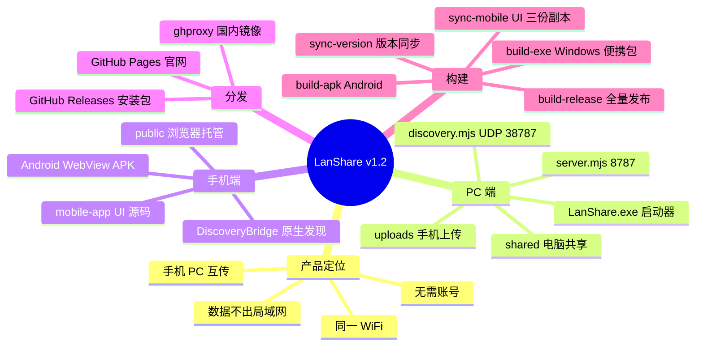
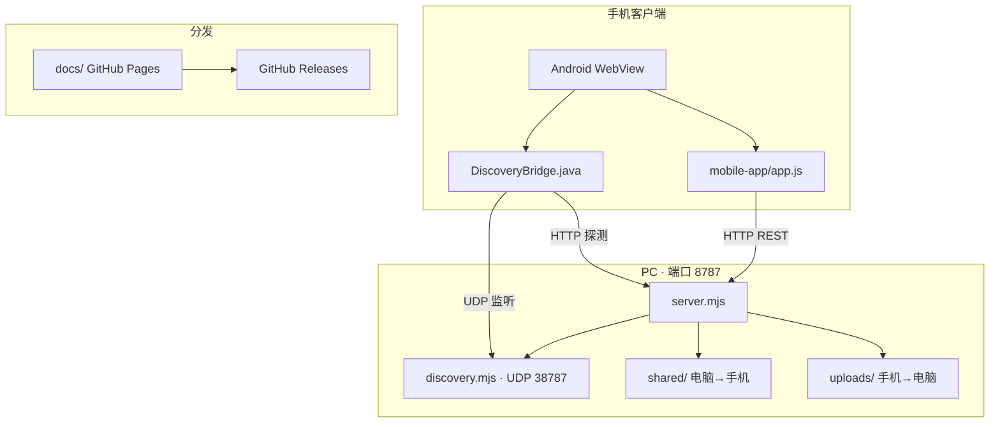
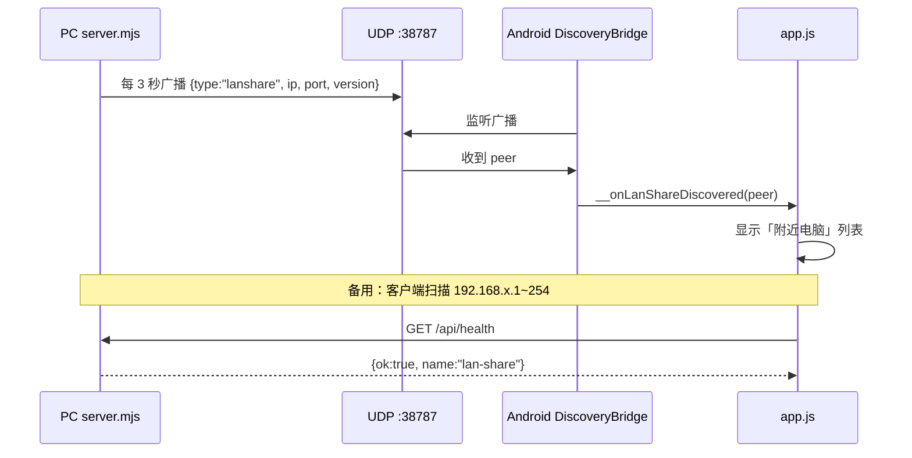
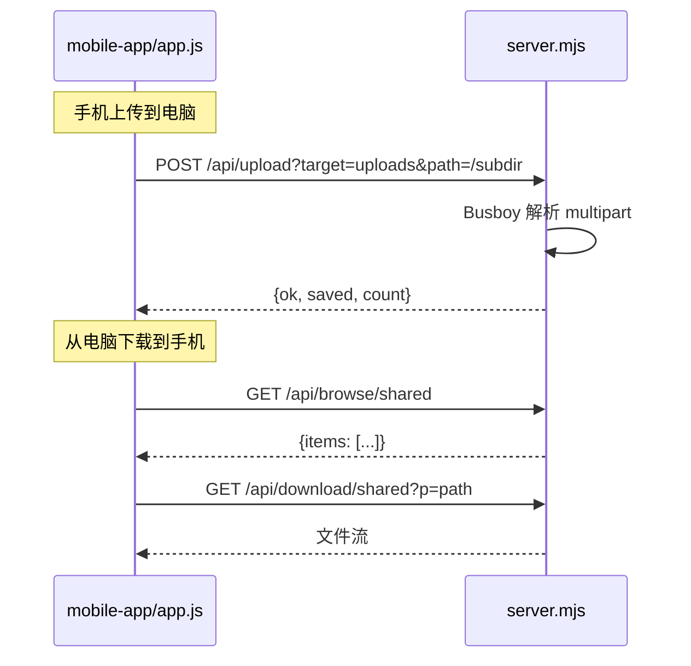
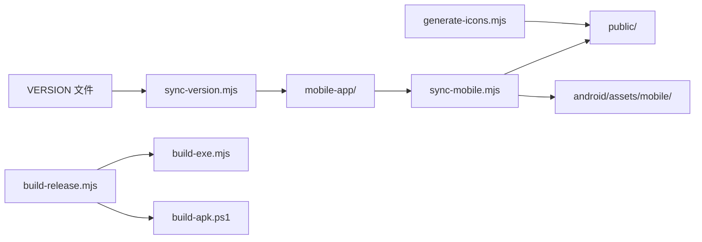

<h1 align="center">LanShare · 电脑互传</h1>

<p align="center">
  手机和电脑在同一 WiFi 下互传文件 · 无需云盘 · 无需账号 · MIT 开源
</p>

<p align="center">
  <a href="https://aiyangdie.github.io/lan-share/"><strong>官网下载</strong></a> ·
  <a href="https://github.com/aiyangdie/lan-share/releases">Releases</a> ·
  <a href="README.en.md">English</a>
</p>

<p align="center">
  <a href="https://aiyangdie.github.io/lan-share/"></a>
  <a href="https://github.com/aiyangdie/lan-share/releases"></a>
  
  
</p>

<p align="center">
  
</p>

---

## 下载

**推荐从官网下载（国内可直连）：** 👉 **https://aiyangdie.github.io/lan-share/**

| 平台 | 说明 |
|------|------|
| Windows | 解压 zip，双击 `LanShare.exe`，自动打开 `http://127.0.0.1:8787/` |
| Android | 安装 APK，同一 WiFi 下**自动发现附近电脑**（v1.2+） |
| iPhone | Safari 打开 `http://电脑IP:8787`，添加到主屏幕当 PWA |

历史版本：[GitHub Releases](https://github.com/aiyangdie/lan-share/releases)

---

## 快速开始

1. **电脑** — 运行 LanShare（Windows 双击 exe，或 `npm start`）
2. **手机** — 安装 APK 或浏览器打开，确保与电脑**同一 WiFi**
3. **传文件**
   - 手机 → 电脑：在 App 里上传，文件保存到电脑 `uploads/`
   - 电脑 → 手机：把文件放进 `shared/`，手机在「电脑共享」里下载

<p align="center">
  
</p>

---

## 特性

- 局域网传输，**数据不出本地网络**
- 手机**自动发现**附近电脑（UDP + 子网扫描，v1.2+）
- 上传 / 浏览 / 共享，**双向互传**
- 纯 Node 服务端 + Web UI，Android WebView 壳，**零云依赖**
- MIT 开源，可自由使用、修改、二次分发

---

## 项目思维导图



---

## 架构总览



---

## 源码目录结构

```
lan-share/
├── server.mjs                 # PC 端 HTTP 服务（核心）
├── package.json               # 仅依赖 busboy
├── VERSION                    # 版本号唯一真源
│
├── scripts/
│   ├── discovery.mjs          # UDP 自动发现 + 子网扫描
│   ├── sync-version.mjs       # 同步版本到各端
│   ├── sync-mobile.mjs        # mobile-app → public + android
│   ├── build-exe.mjs          # Windows 便携 zip + LanShare.exe
│   ├── build-release.mjs      # 完整发布流水线
│   ├── build-apk.ps1          # Android APK 构建
│   └── LanShareLauncher.cs    # Windows C# 启动器
│
├── mobile-app/                # ★ UI 源码（改这里）
│   ├── index.html
│   ├── app.js
│   ├── app.css
│   ├── version.js
│   └── manifest.webmanifest
│
├── public/                    # 同步副本（server 静态托管）
├── android/                   # WebView APK + 原生 UDP 发现
│   └── app/src/main/java/com/lanshare/app/
│       ├── MainActivity.java
│       └── DiscoveryBridge.java
│
└── docs/                      # GitHub Pages 官网
    ├── index.html
    ├── releases.json
    └── images/                # 架构示意图
```

> **改 UI 只改 `mobile-app/`**，然后执行 `npm run sync` 同步到 `public/` 和 Android assets。

---

## 自动发现流程（v1.2+）



手机端三层发现策略（由快到慢）：

1. **Android 原生 UDP** — `DiscoveryBridge.java` 监听 38787
2. **服务端 API** — `GET /api/discover/peers`
3. **客户端子网扫描** — `app.js` 批量探测 `/api/health`

---

## 文件传输流程



---

## HTTP API 一览

| 方法 | 路径 | 说明 |
|------|------|------|
| `GET` | `/api/health` | 健康检查，`name` 必须为 `lan-share` |
| `GET` | `/api/discover/peers` | UDP 被动发现的附近电脑（30s TTL） |
| `GET` | `/api/discover/scan` | 主动扫描 /24 子网 |
| `GET` | `/api/roots` | 根目录：`uploads` / `shared` |
| `GET` | `/api/browse/{root}/{path}` | 浏览文件夹 |
| `GET` | `/api/download/{root}?p=...` | 下载文件（支持 Range） |
| `POST` | `/api/upload?target=&path=` | 上传文件（multipart） |
| `GET` | `/*` | 静态 Web UI（`public/` → `mobile-app/`） |

### 关键常量

| 常量 | 值 | 含义 |
|------|-----|------|
| HTTP 端口 | `8787` | 服务端口（可用 `PORT` 环境变量覆盖） |
| UDP 端口 | `38787` | 局域网发现广播 |
| 协议标识 | `lanshare` | UDP 包 `type` 字段 |
| 服务标识 | `lan-share` | `/api/health` 的 `name` 字段 |
| localStorage | `lan_share_server` | 手机端保存的服务器地址 |

### 数据目录

| 目录 | 方向 | 说明 |
|------|------|------|
| `shared/` | 电脑 → 手机 | 放入文件，手机可下载 |
| `uploads/` | 手机 → 电脑 | 手机上传的文件保存在此 |

---

## Android 原生层

| 文件 | 作用 |
|------|------|
| `MainActivity.java` | WebView 壳，加载 `assets/mobile/index.html` |
| `DiscoveryBridge.java` | UDP 38787 监听 + 子网 HTTP 探测 |

暴露给 WebView 的 JS 接口：

```javascript
window.LanShareNative.getWifiIp()           // 获取 WiFi IP
window.LanShareNative.getDiscoveredPeers()  // UDP 发现的电脑 JSON
window.__onLanShareDiscovered(peer)         // 实时发现回调
window.__pullRefresh()                      // 下拉刷新
window.__onBack()                           // 返回键
```

---

## 构建与发布流水线



| 命令 | 产出 |
|------|------|
| `npm start` | 启动服务 `localhost:8787` |
| `npm run sync` | 同步版本号 + UI 三份副本 |
| `npm run build:exe` | Windows 便携 zip + `LanShare.exe` |
| `npm run build:apk` | Android APK `电脑互传.apk` |
| `npm run build:release` | 全套：APK + exe + 各平台 server 包 |

**Windows 启动器 `LanShare.exe`：**
- 启动内嵌 `node.exe server.mjs`
- 自动打开浏览器 `http://127.0.0.1:8787/`
- 自动创建 `shared/` + `uploads/`

---

## 开发

**环境要求：** Node.js ≥ 18

```bash
git clone https://github.com/aiyangdie/lan-share.git
cd lan-share
npm install
npm start                    # http://127.0.0.1:8787
```

```bash
npm run sync                 # 改完 mobile-app 后同步
npm run build:release        # 打包全部安装包
```

### 组件连接关系

| 层 | 技术 | 职责 |
|----|------|------|
| 服务端 | Node.js + Busboy | HTTP API、文件读写、UDP 广播 |
| 客户端 UI | 纯 JS/CSS/HTML | 浏览 / 上传 / 下载 / 发现 |
| Android | WebView + Java | 原生 UDP 发现、文件选择、下载 |
| 构建 | mjs / ps1 / cs | 便携 exe、APK、多平台 server 包 |
| 分发 | GitHub Pages + Releases | 官网下载 + ghproxy 国内镜像 |

---

## 开源信息

- **仓库：** https://github.com/aiyangdie/lan-share
- **官网：** https://aiyangdie.github.io/lan-share/
- **协议：** [MIT](LICENSE)
- **作者：** [aiyangdie](https://github.com/aiyangdie) · aike1015@qq.com

欢迎 Star、Issue、PR。
